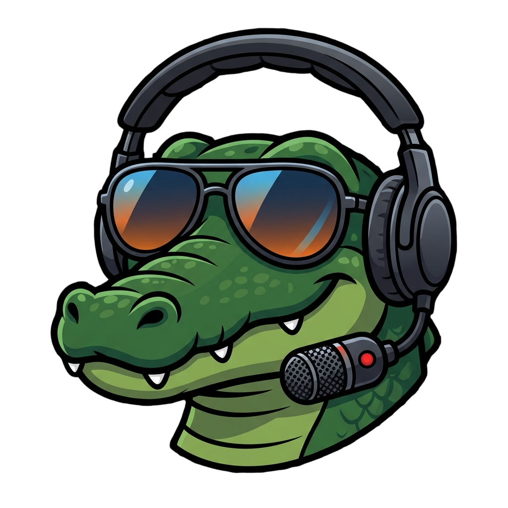

<p align="center">
  
</p>

<h1 align="center">Noise Gator</h1>

<p align="center">
  Lightweight real-time microphone noise cancellation for Windows and macOS.
</p>

<p align="center">
  
  
  
  
</p>

---

Noise Gator is a standalone system tray application that captures your microphone input, runs it through a real-time noise suppression pipeline, and routes the clean audio to a virtual audio device. Other applications (Discord, Teams, Zoom) pick up the virtual device as their microphone input.

No Electron. No web runtime. A single ~23MB binary.

## Features

- **Dual denoise engines** -- [DeepFilterNet](https://github.com/Rikorose/DeepFilterNet) (default) and [RNNoise](https://github.com/jmvalin/rnnoise) (lightweight fallback)
- **DSP pipeline** -- Highpass pre-filter, noise suppression, VAD-driven noise gate, 3-band EQ, auto-gain normalization
- **System tray control** -- Start/stop, device selection, engine switching, DSP toggles -- all from the tray menu
- **Virtual audio driver** -- Auto-installs [VB-Cable](https://vb-audio.com/Cable/) on Windows or [BlackHole](https://existential.audio/blackhole/) on macOS
- **Device watchdog** -- Detects USB disconnects and auto-reconnects when the device reappears
- **Config persistence** -- Settings saved to TOML, restored on next launch
- **Headless mode** -- Run without the tray via `--headless` for scripted or server use

## How It Works

```
Microphone → Highpass → Denoise (RNNoise/DeepFilter) → Noise Gate → EQ → AutoGain → Virtual Device
                                                           ↑
                                                     VAD (neural or energy-based)
```

Audio is captured from your real microphone, processed through the DSP chain at 48kHz with 10ms frames, and written to a virtual audio device. The noise gate uses voice activity detection to clamp residual noise between speech.

## Installation

### Pre-built Binary

Download the latest release from the [Releases](https://github.com/danjaniell/noise-gator/releases) page.

On first launch, Noise Gator will prompt to install VB-Cable if it is not already present.

### Building from Source

Prerequisites:
- [Rust](https://www.rust-lang.org/tools/install) 1.85+ (stable)
- On Windows: MinGW-w64 or MSVC toolchain

```bash
git clone https://github.com/danjaniell/noise-gator.git
cd noise-gator
cargo build --release
```

The binary is at `target/release/noise-gator.exe`.

To build without DeepFilterNet (RNNoise only, smaller binary):

```bash
cargo build --release --no-default-features
```

## Usage

```bash
# Launch with system tray (default)
noise-gator

# Specify input device
noise-gator --input "Microphone Array"

# Use DeepFilterNet engine
noise-gator --engine deepfilter

# List available audio devices
noise-gator --list-devices

# Headless mode (no tray, Ctrl+C to stop)
noise-gator --headless

# Skip virtual driver auto-install
noise-gator --skip-driver
```

## Denoise Engines

| Engine | Quality | Size | VAD | Availability |
|--------|---------|------|-----|-------------|
| [DeepFilterNet](https://github.com/Rikorose/DeepFilterNet) | Superior | ~8MB model download on first use | Energy-based | Default |
| [RNNoise](https://github.com/jmvalin/rnnoise) | Good | Bundled (0MB extra) | Neural | Always available |

DeepFilterNet is the default engine. On first use, the ONNX model (~8MB) downloads automatically. RNNoise is available as a lightweight fallback and can be selected from the system tray Engine menu. Build with `--no-default-features` to exclude DeepFilterNet entirely.

## Configuration

Settings are saved to:
- **Windows**: `%APPDATA%\noise-gator\config.toml`
- **macOS**: `~/Library/Application Support/noise-gator/config.toml`
- **Linux**: `~/.config/noise-gator/config.toml`

## Dependencies

| Crate | Purpose |
|-------|---------|
| [cpal](https://crates.io/crates/cpal) | Cross-platform audio I/O |
| [nnnoiseless](https://crates.io/crates/nnnoiseless) | Pure Rust RNNoise port |
| [tray-icon](https://crates.io/crates/tray-icon) + [muda](https://crates.io/crates/muda) | System tray and menu |
| [winit](https://crates.io/crates/winit) | Event loop |
| [rubato](https://crates.io/crates/rubato) | Sinc sample rate conversion |
| [ringbuf](https://crates.io/crates/ringbuf) | Lock-free ring buffer |
| [tract-onnx](https://crates.io/crates/tract-onnx) | ONNX inference (optional, DeepFilterNet) |
| [rustfft](https://crates.io/crates/rustfft) | FFT for STFT/ISTFT (optional, DeepFilterNet) |
| [clap](https://crates.io/crates/clap) | CLI argument parsing |
| [reqwest](https://crates.io/crates/reqwest) | HTTP for driver/model downloads |

## License

MIT
